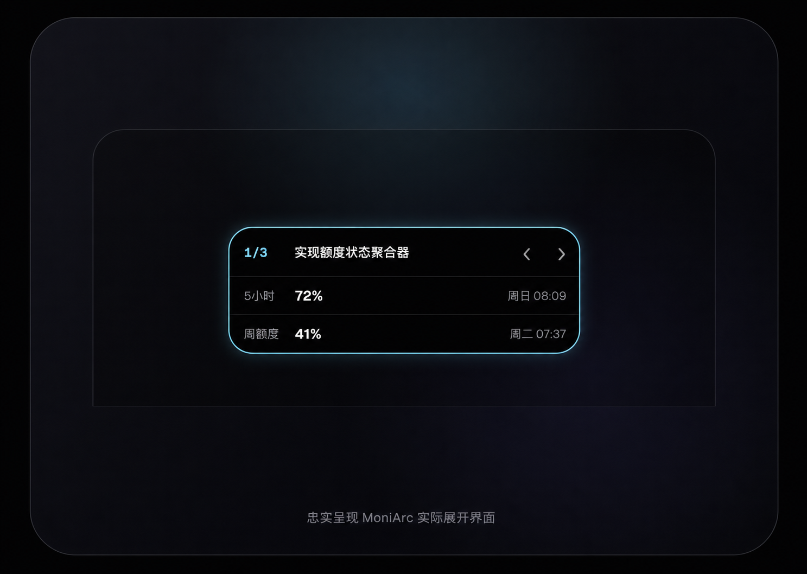

# MoniArc

[English](README.en.md)

MoniArc 是一款原生 macOS 顶部状态岛，用尽可能安静的方式显示本机 Codex 任务状态与使用额度。

它使用 Swift 6、SwiftUI 与 AppKit 编写，不依赖第三方运行时，不上传任务内容，也不会修改 `~/.codex`。

**[访问 MoniArc 项目主页](https://ch3n923.github.io/MoniArc/)**

[](https://ch3n923.github.io/MoniArc/)

> MoniArc 是独立开源项目，与 OpenAI 没有隶属、授权或背书关系。Codex 与 OpenAI 是其各自权利人的商标。

## 功能

- 覆盖刘海或悬浮在屏幕顶部，并自动适配无刘海显示器。
- 显示 Codex 5 小时与周额度，并支持多个额度 bucket。
- 只读观察本机 Codex 生命周期，区分运行、等待用户、错误、空闲与断开。
- Hover 自然展开，移出后自动收起；右键可切换位置、光效或退出。
- 根据 Sol、Terra、Luna 等模型自动匹配光效主题；标准任务使用呼吸效果，快速任务使用流动效果，Sol 快速任务使用太阳耀斑。
- 高、极高、Max 与 Ultra 推理强度会自动请求 HDR；不支持 EDR 的显示器会保持 SDR。
- 尊重 macOS“减少动态效果”设置。
- 不显示 Dock 图标，不主动抢占前台焦点。

## 使用指南

将鼠标移到状态岛上可展开额度与任务信息，移出后会自动收起。在状态岛上点击右键，可使用以下功能：

- **覆盖**：将状态岛贴合在屏幕顶部；有刘海的 Mac 会与刘海区域融合。
- **悬浮**：将状态岛显示为顶部下方的独立圆角浮层。
- **光效**：可选择“自动”“呼吸”或“流动”；Sol 在快速任务下会保持专属太阳耀斑效果。
- **HDR**：可选择“自动”“开启”或“关闭”；自动模式在高、极高、Max 与 Ultra 推理强度下请求 HDR，普通显示器会保持 SDR。
- **GitHub 地址**：在默认浏览器中打开 MoniArc 项目仓库。
- **退出 MoniArc**：关闭应用，也可使用快捷键 `⌘Q`。

状态岛的文字和颜色表示当前 Codex 任务状态：

- **运行中（蓝色）**：至少有一个 Codex 任务正在执行。
- **等待用户（橙色）**：任务需要用户输入、确认或处理后才能继续。
- **发生错误（红色）**：至少有一个任务失败，或检测到终端错误。
- **空闲（灰色）**：已连接到任务源，但当前没有任务在运行或等待处理。
- **任务源断开（深灰色）**：暂时无法正常读取本机 Codex 任务状态；请检查 Codex 是否已安装并登录。

同时存在多个任务时，MoniArc 按“发生错误 → 等待用户 → 运行中 → 空闲”的优先级显示整体状态；如果任务源断开，则优先显示“任务源断开”。

## 安装

MoniArc 仅通过 [GitHub Releases](https://github.com/ch3n923/MoniArc/releases) 分发发布包。它不会在 Mac App Store 或独立官网提供下载。

## 系统要求

- macOS 14 Sonoma 或更高版本。
- 已安装并登录 Codex 桌面应用或 Codex CLI。
- 真实 HDR 光效需要支持 EDR 的显示器，例如 2021 年及以后的 14 英寸或 16 英寸 MacBook Pro 内置 Liquid Retina XDR 显示器。
- Release 配置会生成同时包含 arm64 与 x86_64 的 Universal Binary；实际额度连接仍取决于本机 Codex 的可用性。

MoniArc 会先查找 ChatGPT 应用和常见 CLI 位置，然后只接受 `PATH` 中拥有者和写入权限安全的绝对路径；可被任意用户改写的目录会被跳过。使用其他安装路径时，可从终端显式指定绝对路径：

```sh
MONIARC_CODEX_PATH="/absolute/path/to/codex" open -a MoniArc
```

## 隐私

MoniArc 在本机读取 Codex 的额度响应和有限任务元数据，只用于当前界面显示。它不读取 `auth.json`，不收集 token、代码、回复或工具正文，不包含遥测、广告或分析 SDK，也不会把数据发送给项目维护者。启动 Codex 子进程时只转交必要的系统、Codex/OpenAI 和网络配置环境变量，不转交无关的 GitHub、云服务或动态加载器凭证。

完整说明见 [PRIVACY.md](PRIVACY.md)。

## 本地构建

需要 Xcode 16+ 与 [XcodeGen](https://github.com/yonaskolb/XcodeGen)：

如果 Xcode 提示缺少 Metal Toolchain，请先运行 `xcodebuild -downloadComponent MetalToolchain`。

```sh
brew install xcodegen
xcodegen generate
xcodebuild -project MoniArc.xcodeproj \
  -scheme MoniArc \
  -configuration Debug \
  build CODE_SIGNING_ALLOWED=NO
```

运行调试 Harness：

```sh
xcodebuild -project MoniArc.xcodeproj \
  -scheme MoniArc \
  -configuration Debug \
  -derivedDataPath /tmp/MoniArcDerivedData \
  build CODE_SIGNING_ALLOWED=NO

open -n '/tmp/MoniArcDerivedData/Build/Products/Debug/MoniArc.app' \
  --args --harness
```

## 许可

MoniArc 采用 [MIT License](LICENSE) 开源。
